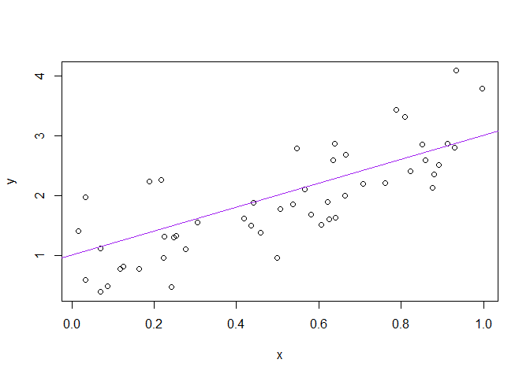

Hello World (in R Markdown)
================
Jonty-JNQ
'r format(Sys.Date())'

This is my Hello World from R Markdown.

Script
------

Here's an R "chunk"

``` r
 n <- 50
 a <- 1
 b <- 2
 sig_sq <- 0.3
 x <- runif(n)
 y <- a + b*x + rnorm(n, sd = sqrt(sig_sq))
 invisible((avg_x <- mean(x)))
 write(avg_x, "avg_x.txt")
 plot(x,y)
 abline(a,b, col = "purple")
```


